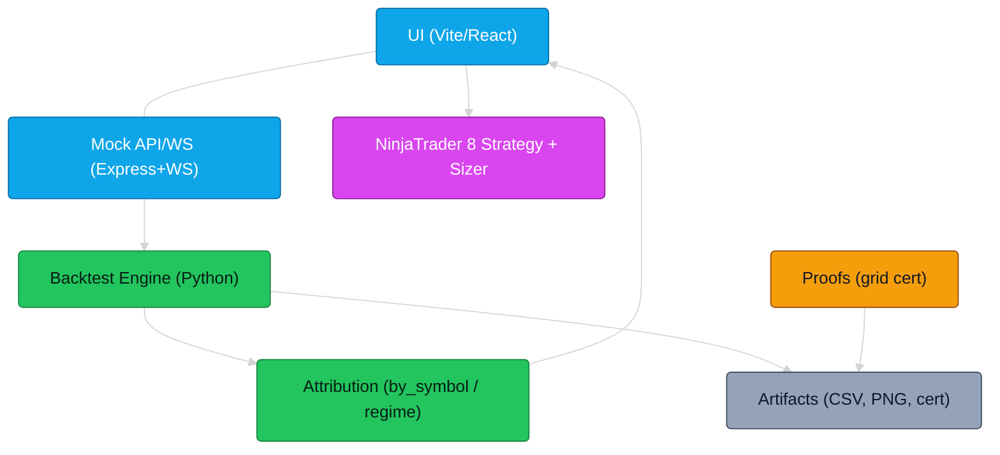
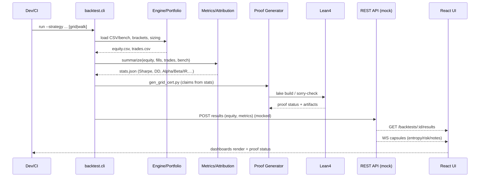

# System Diagram — Entropy Portfolio Lab

Below are Mermaid diagrams you can view on GitHub (yes, it renders now).  
They show the whole stack and the lifecycle of a typical backtest → proof → UI pipeline.

## 1) Architecture (components & data flow)

## 2) Lifecycle (single backtest → proof → UI)

Notes
- OHLC-aware brackets: stops/targets evaluate intrabar High/Low if present, else Close.
- Sizing: units, notional, or ATR-risk (risk_R × ATR, risk_pct of equity).
- Proof capsules: JSON claims + Lean sources + SHA256; CI fails if claims aren’t met.

---

### Legend
- *Engine* = event loop + broker + bracket manager (+ warmup)  
- *Portfolio* = runs multiple assets, combines curves (equal-weight for now)  
- *Metrics* = full suite (incl. Alpha/Beta/IR vs bench)  
- *Optimize/Walk-Forward* = param search + OOS validation, optional Monte Carlo  
- *Proofs* = claim generator → Lean build → artifacts (capsule)  
- *UI* = React/Vite, hits REST for backtest results, WS for live capsules  
- *CI* = Python tests/schema, UI checks/build, proof build (manual/triggered), nightly backtest matrix

### Where to add things quickly
- New strategy research ➜ `backtest/strategies/*`
- New metric ➜ `backtest/metrics/*` and wire into summarize()
- New UI panel ➜ `ui/src/components/*` then route in `/analytics`
- New proof claim ➜ `proofs/gen_grid_cert.py` + `proofs/templates/*`
- New nightly run ➜ `.github/workflows/nightly.yml` (matrix)

---

You drop these files in, and anyone skimming your repo can see the head and the spine at once. It also makes your third-party review read like “uh-huh yep” instead of “what is this mysterious folder called proofs.”

> Rendered images: see `docs/assets/diagram_0.{png,svg}`, `diagram_1.{png,svg}` (CI-generated).
